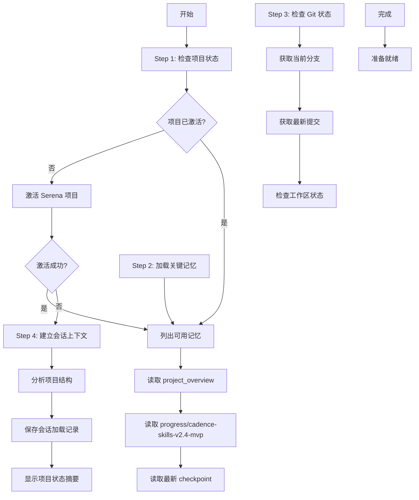

# Cad-Load - 项目上下文加载

## Overview

加载 Cadence 项目上下文，激活项目工作区，读取项目记忆和进度追踪信息，为开发工作流程做准备。

**核心原则**: 快速激活 + 上下文加载 + 进度追踪 = 高效开发准备

**开始时宣布**: "我正在使用 cad-load skill 来加载 Cadence 项目上下文。"

## When to Use

### 使用场景判断

**应该使用**:
- ✅ 会话开始时（新会话或继续之前的工作）
- ✅ 需要查看项目当前状态和进度
- ✅ 需要恢复之前的工作进度
- ✅ 切换到不同的开发任务前
- ✅ 需要了解项目技术栈和配置

**可以跳过**:
- ⚠️ 已经加载过项目上下文
- ⚠️ 只是进行简单的问答
- ⚠️ 不涉及项目开发工作

### 前置条件

- ✅ 当前目录是 Cadence 项目（或子目录）
- ✅ Serena MCP 可用
- ✅ 项目已初始化（存在 .serena 目录）

## The Process



### 详细步骤

#### Step 1: 检查项目状态（5-10秒）

**目标**: 确认项目状态并激活 Serena

**操作**:
1. 检查当前是否已激活项目
2. 如果未激活，激活当前项目
3. 验证激活成功

**检查项**:
```markdown
- [ ] 当前目录是否是项目根目录？
- [ ] Serena MCP 是否可用？
- [ ] 项目是否已初始化？
```

**错误处理**:
```
如果激活失败：
├── 检查 .serena 目录是否存在
├── 检查 Serena MCP 是否正常运行
└── 提供错误诊断和建议
```

---

#### Step 2: 加载关键记忆（10-20秒）

**目标**: 读取项目关键记忆，恢复项目上下文

**核心记忆列表**:

| 记忆名称 | 优先级 | 用途 |
|---------|-------|------|
| `project_overview` | P0 | 项目概述、技术栈、关键规则 |
| `progress/cadence-skills-v2.4-mvp` | P0 | 当前进度、已完成方案 |
| 最新 `checkpoint-*` | P1 | 最新检查点、恢复点 |
| 最新 `sessions/*` | P1 | 最新会话记录 |
| `patterns/*` | P2 | 项目模式和最佳实践 |

**加载策略**:
```javascript
// 1. 列出所有可用记忆
memories = list_memories()

// 2. 按优先级读取关键记忆
read_memory("project_overview")
read_memory("progress/cadence-skills-v2.4-mvp")

// 3. 读取最新的 checkpoint（按时间排序）
latest_checkpoints = memories.filter(m => m.startsWith("checkpoint-"))
                             .sort()
                             .slice(0, 3)
latest_checkpoints.forEach(cp => read_memory(cp))

// 4. 可选：读取最新的会话记录
latest_sessions = memories.filter(m => m.startsWith("sessions/"))
                         .sort()
                         .slice(0, 2)
```

**输出**:
```
✅ 已加载 4 个关键记忆：
- project_overview（项目概述）
- progress/cadence-skills-v2.4-mvp（进度追踪）
- checkpoint-2026-03-02-scheme6-implementation-complete
- sessions/2026-03-02_scheme7_completion
```

---

#### Step 3: 检查 Git 状态（5-10秒）

**目标**: 了解当前 Git 状态和最新提交

**操作**:
```bash
# 获取当前分支
git branch --show-current

# 获取最新 5 条提交
git log --oneline -5

# 检查工作区状态
git status --short
```

**输出**:
```
📊 Git 状态：
- 当前分支：main
- 最新提交：95e29d5 - 增加claude规则
- 工作区状态：clean
```

---

#### Step 4: 建立会话上下文（10-15秒）

**目标**: 保存会话加载记录，建立完整的会话上下文

**操作**:
1. 分析项目结构（列出主要目录）
2. 保存会话加载记录到 Serena memory
3. 显示项目状态摘要

**保存会话记录**:
```javascript
write_memory({
  memory_name: `sessions/${date}_session_loaded`,
  content: {
    loaded_at: new Date().toISOString(),
    project: "Cadence-skills",
    version: "v2.4 MVP",
    status: "100% (7/7 schemes)",
    git_branch: "main",
    latest_commit: "95e29d5",
    loaded_memories: [
      "project_overview",
      "progress/cadence-skills-v2.4-mvp",
      "checkpoint-2026-03-02-scheme6-implementation-complete",
      "sessions/2026-03-02_scheme7_completion"
    ],
    next_steps: [
      "整体测试所有 Skills 和 Commands",
      "文档完善",
      "发布 v2.4 MVP"
    ]
  }
})
```

**项目状态摘要**:
```
✅ Cadence 项目上下文已加载

📦 项目信息：
- 项目名称：Cadence-skills
- 当前版本：v2.4 MVP
- 完成状态：100% (7/7 schemes)
- Git 分支：main
- 最新提交：95e29d5 - 增加claude规则

🎯 已完成内容：
- ✅ 8 个核心节点 Skills
- ✅ 3 个流程 Skills
- ✅ 9 个 Commands
- ✅ 3 个 Subagent Prompts

📈 进度追踪：
- 设计进度：7/7 (100%)
- 实施进度：7/7 (100%)

💾 已加载记忆：
- project_overview（项目概述）
- progress/cadence-skills-v2.4-mvp（进度追踪）
- checkpoint-2026-03-02-scheme6-implementation-complete
- sessions/2026-03-02_scheme7_completion

🚀 会话已就绪，可以开始工作！
```

---

#### 完成

**会话状态**: ✅ 已就绪

**可用操作**:
- 查看项目进度：读取 `progress/cadence-skills-v2.4-mvp`
- 恢复之前的工作：使用 `/resume` 命令
- 查看详细状态：使用 `/status` 命令
- 开始新功能开发：使用 `full-flow` 或其他流程 Skills

## Input/Output

### 输入

**可选参数**:
- `--quick` - 快速加载（只加载 P0 记忆）
- `--full` - 完整加载（加载所有相关记忆）
- `--checkpoint <name>` - 加载特定检查点

**输入来源**:
- 当前目录（自动检测项目路径）
- Serena memory 系统（读取项目记忆）
- Git 仓库（读取状态和提交历史）

### 输出

#### 产物1：会话上下文
- 项目激活状态
- 关键记忆已加载
- Git 状态已确认

#### 产物2：会话记录
- Session Summary（保存到 Serena memory）
- 加载时间戳
- 加载的记忆列表

#### 产物3：项目状态摘要
- 项目信息（名称、版本、状态）
- 已完成内容统计
- 进度追踪信息
- 下一步建议

## Integration

### 前置 Skills

**无依赖** - `cad-load` 是 Cadence 流程的入口点

### 后续 Skills

**所有 Cadence Skills** 都依赖 `cad-load` 建立的会话上下文：
- `full-flow` - 完整开发流程
- `quick-flow` - 快速开发流程
- `exploration-flow` - 探索流程
- 所有节点 Skills（brainstorm, analyze, requirement 等）

### 相关 Commands

- `/status` - 查看进度（需要 `cad-load` 加载的记忆）
- `/resume` - 恢复进度（需要 `cad-load` 激活的项目）
- `/checkpoint` - 创建检查点（需要 `cad-load` 的 Serena 连接）
- `/report` - 生成报告（需要 `cad-load` 的项目上下文）

## Checklist

### 准备阶段
- [ ] 当前目录是否是项目目录？
- [ ] Serena MCP 是否可用？
- [ ] 项目是否已初始化？

### 激活阶段
- [ ] 项目是否成功激活？
- [ ] Onboarding 是否已完成？

### 加载阶段
- [ ] project_overview 是否加载？
- [ ] progress 记忆是否加载？
- [ ] 最新 checkpoint 是否加载？

### Git 检查阶段
- [ ] 当前分支是否正确？
- [ ] 最新提交是否符合预期？
- [ ] 工作区状态是否 clean？

### 会话建立阶段
- [ ] 会话记录是否保存？
- [ ] 项目状态摘要是否显示？
- [ ] 用户是否确认就绪？

## Red Flags

**绝不**:
- 在 Serena MCP 不可用时强行加载
- 跳过关键记忆加载（project_overview, progress）
- 忽略 Git 状态异常（未提交的更改）
- 覆盖现有会话上下文而不保存检查点

**始终**:
- 验证 Serena MCP 连接
- 加载 P0 优先级记忆
- 检查 Git 状态
- 保存会话加载记录
- 提供清晰的状态摘要

## Example Workflow

### 示例1：新会话加载

```
你: 我正在使用 cad-load skill 来加载 Cadence 项目上下文。

[Step 1: 检查项目状态]
✅ 项目已激活：Cadence-skills

[Step 2: 加载关键记忆]
✅ 已加载 4 个关键记忆：
- project_overview（项目概述）
- progress/cadence-skills-v2.4-mvp（进度追踪）
- checkpoint-2026-03-02-scheme6-implementation-complete
- sessions/2026-03-02_scheme7_completion

[Step 3: 检查 Git 状态]
📊 Git 状态：
- 当前分支：main
- 最新提交：95e29d5 - 增加claude规则
- 工作区状态：clean

[Step 4: 建立会话上下文]
✅ 会话记录已保存：sessions/2026-03-02_session_loaded

✅ Cadence 项目上下文已加载

📦 项目信息：
- 项目名称：Cadence-skills
- 当前版本：v2.4 MVP
- 完成状态：100% (7/7 schemes)

🚀 会话已就绪，可以开始工作！
```

### 示例2：快速加载

```
你: 我正在使用 cad-load skill 来加载 Cadence 项目上下文。

[使用 --quick 参数，只加载 P0 记忆]

✅ 快速加载完成（耗时：8秒）
- project_overview ✓
- progress/cadence-skills-v2.4-mvp ✓

🚀 会话已就绪！
```

### 示例3：加载特定检查点

```
你: 我正在使用 cad-load skill 来加载 Cadence 项目上下文。

[使用 --checkpoint checkpoint-2026-03-01-scheme4-implementation-complete]

✅ 已加载检查点：方案4实施完成
- 时间：2026-03-01
- 状态：方案4已完成，方案5待开始
- 下一步：开始方案5设计

🚀 已恢复到方案4完成时的状态！
```

## 时间预估

| 加载模式 | 加载记忆数 | 时间范围 |
|---------|-----------|---------|
| 🟢 快速（--quick） | 2个（P0） | 5-10秒 |
| 🟡 标准（默认） | 4-6个 | 15-30秒 |
| 🔴 完整（--full） | 10+个 | 30-60秒 |

**性能优化建议**:
- 日常使用 `--quick` 模式即可
- 需要详细了解项目状态时使用标准模式
- 需要完整上下文时使用 `--full` 模式

## 错误处理

### 常见错误

#### 错误1：Serena MCP 不可用
```
❌ 错误：Serena MCP 不可用

诊断：
1. 检查 Serena MCP 是否已安装
2. 检查 Claude Code 配置
3. 重启 Claude Code

建议：
- 查看 Serena MCP 文档
- 使用 claude-config 检查 MCP 配置
```

#### 错误2：项目未初始化
```
❌ 错误：项目未初始化（缺少 .serena 目录）

诊断：
1. 当前目录可能不是项目根目录
2. 项目可能未使用 Serena 初始化

建议：
- 确认当前目录是否正确
- 运行项目初始化流程
```

#### 错误3：记忆不存在
```
⚠️ 警告：某些记忆不存在

已跳过的记忆：
- checkpoint-2026-02-25-old-checkpoint

原因：记忆可能已被清理或重命名

影响：不影响当前会话，使用现有记忆即可
```

## 与 SuperClaude /sc:load 的区别

| 特性 | Cadence cad-load | SuperClaude /sc:load |
|------|-----------------|---------------------|
| **目标项目** | Cadence-skills 专用 | 通用项目 |
| **记忆结构** | Cadence 特定（project_overview, progress） | 通用项目记忆 |
| **进度追踪** | 集成 Cadence v2.4 MVP 进度系统 | 通用进度追踪 |
| **流程集成** | 与 full-flow/quick-flow 深度集成 | 独立使用 |
| **Git 检查** | 自动检查 Git 状态 | 可选检查 |
| **加载策略** | 按 P0/P1/P2 优先级加载 | 统一加载 |

## 最佳实践

### 1. 会话开始时立即加载
```
✅ 推荐：
会话开始 → 立即使用 cad-load → 开始工作

❌ 不推荐：
会话开始 → 直接工作 → 遇到问题 → 才想起加载上下文
```

### 2. 根据需求选择加载模式
```
简单任务 → --quick 模式（5-10秒）
正常开发 → 标准模式（15-30秒）
复杂任务 → --full 模式（30-60秒）
```

### 3. 定期检查项目状态
```
使用 cad-load 后：
1. 查看 Git 状态（确认分支和提交）
2. 查看进度追踪（确认当前进度）
3. 查看下一步建议（明确工作方向）
```

### 4. 结合进度追踪使用
```
cad-load → 加载上下文
↓
/status → 查看详细进度
↓
/resume → 恢复之前的工作
↓
/checkpoint → 保存进度
```
