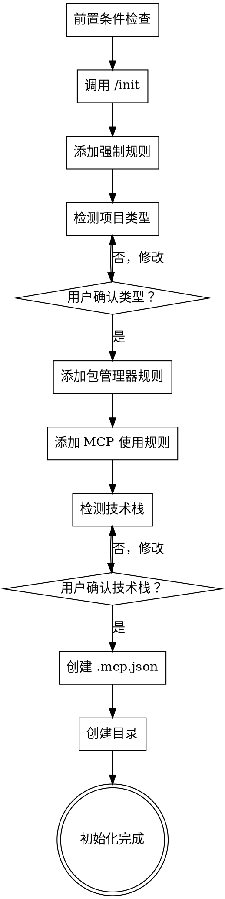

# 项目初始化

## 概述

初始化现有项目为 Cadence 管理项目，自动配置环境、规则、文档结构和技术栈。

<HARD-GATE>
不要跳过任何检查清单项目。每个步骤必须按顺序完成并通过验证后才能进行下一步。技术栈检测和项目类型检测需要用户确认。
</HARD-GATE>

## 前置条件检查

在执行初始化之前，必须检查以下前置条件：

### 1. 检查 npx 是否可用

```bash
npx --version
```

**如果未安装：**
- **macOS/Linux**: `npm install -g npx` 或安装 Node.js (包含 npm/npx)
- **Windows**: 安装 Node.js，npx 会随 npm 一起安装

### 2. 检查 uvx 是否可用

```bash
uvx --version
```

**如果未安装：**
- **macOS/Linux**: `curl -LsSf https://astral.sh/uv/install.sh | sh`
- **Windows**: `powershell -c "irm https://astral.sh/uv/install.ps1 | iex"`

### 3. 检查 Serena 本地克隆

询问用户 Serena 仓库的本地路径：
- "请提供 Serena 仓库在本地的克隆路径（例如：~/Documents/git-folder/github-folder/serena 或 C:\\Users\\username\\Projects\\serena）"

**验证路径：**
- 检查路径是否存在
- 检查路径下是否有 `pyproject.toml` 或 `setup.py`
- 如果路径不存在，提示用户先克隆 Serena：`git clone https://github.com/orisenbazuru/serena.git`

### 4. 跨平台路径处理

| 系统 | 路径示例 | 处理方式 |
|------|---------|---------|
| macOS | `/Users/name/serena` | 直接使用，支持 `~` 展开 |
| Linux | `/home/name/serena` | 直接使用，支持 `~` 展开 |
| Windows | `C:\\Users\\name\\serena` | 使用反斜杠或转义为 `\\` |

## 检查清单

你必须为以下每个项目创建任务并按顺序完成：

1. **前置条件检查** — 检查 npx、uvx、serena 路径
2. **Claude Code 初始化** — 调用 `/init` 命令，验证 CLAUDE.md 已创建
3. **添加语言规则** — 配置强制中文响应
4. **添加文档规则** — 配置 `.claude` 目录结构和命名规范
5. **检测项目类型** — 识别前端/后端/全栈，获取用户确认
6. **添加包管理器规则** — 前端使用 pnpm，Python 使用 uv（如适用）
7. **添加 MCP 使用规则** — 添加各 MCP server 的使用规则到 CLAUDE.md
8. **检测技术栈** — 自动检测语言、测试/检查/格式化命令，获取用户确认
9. **添加 MCP 配置** — 在项目根目录创建 `.mcp.json` 配置
10. **创建目录结构** — 创建 `.claude/` 子目录

**下一步（必须）**：执行 `/cad-load` 加载项目上下文和记忆

## 流程图



**终端状态是初始化完成。** 展示已配置内容的摘要，并建议下一步：必须先执行 `/cad-load` 加载项目上下文，然后选择工作流程（quick-flow、full-flow 或 exploration-flow）。

## 处理流程

### 前置条件处理

**检查 npx：**
```bash
# 检查命令
npx --version

# 预期输出：版本号，如 10.2.3
```

**检查 uvx：**
```bash
# 检查命令
uvx --version

# 预期输出：版本号，如 0.4.20
```

**获取 Serena 路径：**
```
询问用户："请提供 Serena 仓库的本地路径"
示例：
- macOS: /Users/username/Documents/serena
- Linux: /home/username/projects/serena
- Windows: C:\Users\username\Documents\serena
```

### 强制规则配置

- 添加语言规则：必须使用中文响应
- 添加文档存储规则：所有文档存放在 `.claude/` 目录
- 添加文档命名规则：`YYYY-MM-DD_类型_名称_v版本.扩展名`

### 项目类型检测

- 前端：`package.json` + 前端框架配置
- 后端：后端语言文件 + 框架
- 全栈：同时包含前端和后端
- 其他：文档、配置或工具项目
- 继续前必须获取用户确认

### 技术栈检测

- 语言：JavaScript/TypeScript、Python、Java、Go、Rust
- 测试命令：`pnpm test`、`pytest tests/`、`mvn test` 等
- 检查命令：`pnpm lint`、`flake8`、`mvn checkstyle:check` 等
- 格式化命令：`pnpm format`、`black`、`mvn spotless:apply` 等
- 覆盖率阈值：80%（可配置）
- 写入 CLAUDE.md 前必须获取用户确认

### MCP 使用规则

在 CLAUDE.md 中添加以下 MCP server 使用规则：

```markdown
## MCP Server 使用规则

### Time MCP

**用途**：获取当前时间和时区转换

**触发场景**：
- 需要获取当前日期时间
- 需要进行时区转换
- 用户询问"现在几点"、"今天日期"等

**使用方式**：
```json
{
  "tool": "mcp__time__get_current_time",
  "timezone": "Asia/Shanghai"
}
```

### Context7 MCP

**用途**：获取官方技术文档和代码示例

**触发场景**：
- 遇到 import/require 语句
- 使用框架特定功能（React、Vue、Next.js 等）
- 需要官方 API 文档而非通用解决方案
- 版本特定实现要求

**使用方式**：
1. 先调用 `mcp__context7__resolve-library-id` 解析库 ID
2. 再调用 `mcp__context7__get-library-docs` 获取文档

**示例**：
```json
// 步骤1：解析库
{"libraryName": "react"}
// 返回："/react/react"

// 步骤2：获取文档
{"context7CompatibleLibraryID": "/react/react", "topic": "hooks"}
```

### Sequential Thinking MCP

**用途**：复杂问题的多步骤推理

**触发场景**：
- 复杂调试场景（多层级）
- 架构分析和系统设计
- 使用 `--think`、`--think-hard`、`--ultrathink` 标志
- 需要假设测试和验证的问题
- 多组件故障调查

**使用方式**：
```json
{
  "tool": "mcp__sequential-thinking__sequentialthinking",
  "thought": "当前思考内容",
  "thoughtNumber": 1,
  "totalThoughts": 5,
  "nextThoughtNeeded": true
}
```

### Serena MCP

**用途**：语义代码理解和项目内存

**触发场景**：
- 符号操作：重命名、提取、移动函数/类
- 项目级代码导航和探索
- 多语言项目
- 会话生命周期管理（`/sc:load`、`/sc:save`）
- 大型代码库分析（>50 文件）

**常用命令**：
- `mcp__serena__activate_project` - 激活项目
- `mcp__serena__list_memories` - 列出记忆
- `mcp__serena__find_symbol` - 查找符号
- `mcp__serena__get_symbols_overview` - 获取符号概览
```

### MCP 配置文件创建

**在项目根目录创建 `.mcp.json`：**

```json
{
  "mcpServers": {
    "time": {
      "command": "uvx",
      "args": [
        "mcp-server-time",
        "--local-timezone=Asia/Shanghai"
      ]
    },
    "context7": {
      "type": "stdio",
      "command": "npx",
      "args": [
        "-y",
        "@upstash/context7-mcp"
      ],
      "env": {}
    },
    "sequential-thinking": {
      "type": "stdio",
      "command": "npx",
      "args": [
        "-y",
        "@modelcontextprotocol/server-sequential-thinking"
      ],
      "env": {}
    },
    "serena": {
      "type": "stdio",
      "command": "uvx",
      "args": [
        "--from",
        "{{SERENA_PATH}}",
        "serena",
        "start-mcp-server",
        "--context",
        "ide-assistant",
        "--enable-web-dashboard",
        "false",
        "--enable-gui-log-window",
        "false"
      ],
      "env": {}
    }
  }
}
```

**说明**：
- `{{SERENA_PATH}}` 需要替换为用户提供的 Serena 本地路径
- Windows 路径需要处理反斜杠（使用 `\\` 或转换为正斜杠 `/`）

### 目录结构创建

```
.claude/
├── docs/           # 需求文档
├── designs/        # 设计文档
├── readmes/        # README 文档
├── modao/          # 界面原型
├── model/          # 数据模型
├── architecture/   # 架构文档
├── notes/          # 开发笔记
├── analysis/       # 分析报告
└── logs/           # 开发日志
```

## 初始化完成后

**摘要展示：**
显示已配置内容：
- 项目类型
- 编程语言
- 包管理器
- 测试/检查/格式化命令
- 已添加的 MCP 服务器（time、context7、sequential-thinking、serena）
- `.mcp.json` 配置路径
- 已创建的目录

**下一步（必须）：**

### 1. 加载项目上下文 — `/cad-load`（必须）

`/cadencing` 完成后，**必须先执行 `/cad-load`** 来加载项目上下文和记忆：

- 恢复项目会话状态
- 加载 Serena MCP 记忆
- 激活项目配置
- 准备开发环境

> **注意**：`/cad-load` 是 `/cadencing` 后的必需步骤，不加载上下文将无法使用 Cadence 的完整功能。

### 2. 选择工作流程

加载完成后，可以选择以下工作流程：

1. **Quick flow** — `/cadence:quick-flow` 快速开发（4 步）
2. **Full flow** — `/cadence:full-flow` 完整流程（8 步）
3. **Exploration flow** — `/cadence:exploration-flow` 技术探索（4 步）

## 核心原则

- **前置条件检查** — 必须先验证 npx、uvx、serena 路径
- **需要用户确认** — 技术栈和项目类型检测必须经过确认
- **跨平台兼容** — 适配 macOS/Linux/Windows 的路径和命令
- **幂等性** — 重复执行应该是安全的，不会重复配置
- **错误处理** — 每个步骤应该有清晰的错误信息和恢复建议
- **不跳过** — 所有检查清单项目必须按顺序完成

## 错误恢复

**常见问题：**

| 问题 | 恢复方案 |
|------|----------|
| npx 未找到 | 提示安装 Node.js：`https://nodejs.org/` |
| uvx 未找到 | 提示安装 uv：`curl -LsSf https://astral.sh/uv/install.sh \| sh` |
| Serena 路径不存在 | 提示克隆仓库：`git clone https://github.com/orisenbazuru/serena.git` |
| CLAUDE.md 已存在 | 询问：覆盖、合并或取消 |
| 技术栈检测不准确 | 通过 `--project-type` 允许手动指定 |
| .mcp.json 已存在 | 询问：覆盖、合并或取消 |
| 项目类型检测失败 | 默认为"其他"并询问手动指定 |

## 参数

| 参数 | 类型 | 说明 |
|-----------|------|-------------|
| `--skip-init` | flag | 跳过 `/init` 命令调用 |
| `--skip-checks` | flag | 跳过前置条件检查 |
| `--skip-tech-stack` | flag | 跳过技术栈检测和配置 |
| `--skip-mcp` | flag | 跳过 MCP 配置 |
| `--chinese` | flag | 强制 CLAUDE.md 中文本地化 |
| `--project-type` | string | 手动指定项目类型（frontend/backend/fullstack/other） |
| `--serena-path` | string | 手动指定 Serena 本地路径 |
