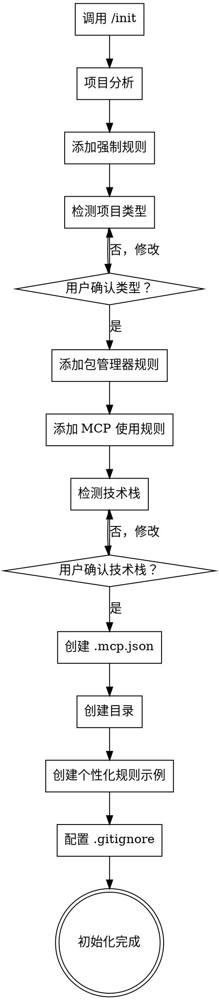

# 项目初始化

## 概述

初始化现有项目为 Cadence 管理项目，自动配置环境、规则、文档结构和技术栈。

<HARD-GATE>
不要跳过任何检查清单项目。每个步骤必须按顺序完成并通过验证后才能进行下一步。技术栈检测和项目类型检测需要用户确认。
</HARD-GATE>

## 检查清单

你必须为以下每个项目创建任务并按顺序完成：

1. **Claude Code 初始化** — 调用 `/init` 命令，验证 CLAUDE.md 已创建
2. **项目分析** — 分析项目结构、依赖、Git 历史，生成摘要文档
3. **添加语言规则** — 配置强制中文响应
4. **添加文档规则** — 配置 `.claude` 目录结构和命名规范
5. **检测项目类型** — 识别前端/后端/全栈，获取用户确认
6. **添加包管理器规则** — 前端使用 pnpm，Python 使用 uv（如适用）
7. **添加 MCP 使用规则** — 添加各 MCP server 的使用规则到 CLAUDE.md
8. **检测技术栈** — 自动检测语言、测试/检查/格式化命令，获取用户确认
9. **添加 MCP 配置** — 在项目根目录创建 `.mcp.json` 配置
10. **创建目录结构** — 创建 `.claude/` 子目录
11. **创建个性化规则示例** — 在 `project-rules/` 中创建示例模板和规范
12. **配置 .gitignore** — 添加 `.serena/` 和 `.worktrees/` 到 .gitignore

**下一步（必须）**：重启 Claude Code，然后执行 `/cad-load` 加载项目上下文和记忆

## 流程图



**终端状态是初始化完成。** 展示已配置内容的摘要，并建议下一步：必须先重启 Claude Code，然后执行 `/cad-load` 加载项目上下文，最后选择工作流程（quick-flow、full-flow 或 exploration-flow）。

## 处理流程

### 项目分析

**分析流程**：

**1. 收集项目信息**
```bash
# 统计文件和目录数量
find . -type f -not -path '*/\.*' | wc -l  # 文件数
find . -type d -not -path '*/\.*' | wc -l  # 目录数

# 识别主要编程语言
find . -name "*.py" -o -name "*.js" -o -name "*.ts" -o -name "*.java" | head -20

# 检测项目类型
ls -la | grep -E "package.json|requirements.txt|pom.xml|go.mod"
```

**2. 分析目录结构**
```bash
# 获取主要目录
find . -maxdepth 2 -type d -not -path '*/\.*' | head -20
```

**3. 分析依赖关系**
- 读取 package.json（前端项目）
- 读取 requirements.txt（Python 项目）
- 读取 pom.xml（Java 项目）

**4. 分析 Git 历史**
```bash
# 最近 10 条提交
git log --oneline -10

# 提交统计
git log --oneline --since="30 days ago" | wc -l
```

**5. 生成分析报告**

**文件路径**：`.claude/analysis-docs/YYYY-MM-DD_分析报告_项目初始化摘要_v1.0.md`

**文件内容模板**：
```markdown
# 项目初始化分析摘要

**生成时间**：[当前时间]
**项目路径**：[项目路径]

## 1. 项目基本信息

- **项目类型**：[前端/后端/全栈/其他]
- **主要语言**：[语言列表]
- **项目规模**：
  - 文件总数：[数量]
  - 目录总数：[数量]
  - 估算代码行数：[数量]

## 2. 目录结构

```
[主要目录树]
```

**目录说明**：
- `src/`：[说明]
- `tests/`：[说明]

## 3. 依赖关系

**主要依赖**：
- [依赖名称]：[版本]

## 4. 主要模块

- **模块 1**：[说明]
- **模块 2**：[说明]

## 5. Git 历史

**最近提交**：
```
[最近 10 条提交]
```

**提交统计**：
- 最近 30 天提交数：[数量]

## 6. 下一步建议

[基于分析的建议]
```

**错误处理**：
- 如果不是 Git 仓库，跳过 Git 历史分析
- 如果文件过多（>10000），显示进度提示
- 超时限制：30 秒

### 强制规则配置

- 添加语言规则：必须使用中文响应
- 添加文档存储规则：所有文档存放在 `.claude/` 目录
- 添加文档命名规则：`YYYY-MM-DD_类型_名称_v版本.扩展名`

### 项目类型检测

- 前端：`package.json` + 前端框架配置
- 后端：后端语言文件 + 框架
- 全栈：同时包含前端和后端
- 其他：文档、配置或工具项目
- 继续前必须获取用户确认

### 技术栈检测

- 语言：JavaScript/TypeScript、Python、Java、Go、Rust
- 测试命令：`pnpm test`、`pytest tests/`、`mvn test` 等
- 检查命令：`pnpm lint`、`flake8`、`mvn checkstyle:check` 等
- 格式化命令：`pnpm format`、`black`、`mvn spotless:apply` 等
- 覆盖率阈值：80%（可配置）
- 写入 CLAUDE.md 前必须获取用户确认

### MCP 使用规则

在 CLAUDE.md 中添加以下 MCP server 使用规则：

```markdown
## MCP Server 使用规则

### Time MCP

**用途**：获取当前时间和时区转换

**触发场景**：
- 需要获取当前日期时间
- 需要进行时区转换
- 用户询问"现在几点"、"今天日期"等

**使用方式**：
```json
{
  "tool": "mcp__time__get_current_time",
  "timezone": "Asia/Shanghai"
}
```

### Context7 MCP

**用途**：获取官方技术文档和代码示例

**触发场景**：
- 遇到 import/require 语句
- 使用框架特定功能（React、Vue、Next.js 等）
- 需要官方 API 文档而非通用解决方案
- 版本特定实现要求

**使用方式**：
1. 先调用 `mcp__context7__resolve-library-id` 解析库 ID
2. 再调用 `mcp__context7__get-library-docs` 获取文档

**示例**：
```json
// 步骤1：解析库
{"libraryName": "react"}
// 返回："/react/react"

// 步骤2：获取文档
{"context7CompatibleLibraryID": "/react/react", "topic": "hooks"}
```

### Sequential Thinking MCP

**用途**：复杂问题的多步骤推理

**触发场景**：
- 复杂调试场景（多层级）
- 架构分析和系统设计
- 使用 `--think`、`--think-hard`、`--ultrathink` 标志
- 需要假设测试和验证的问题
- 多组件故障调查

**使用方式**：
```json
{
  "tool": "mcp__sequential-thinking__sequentialthinking",
  "thought": "当前思考内容",
  "thoughtNumber": 1,
  "totalThoughts": 5,
  "nextThoughtNeeded": true
}
```

### Serena MCP

**用途**：语义代码理解和项目内存

**触发场景**：
- 符号操作：重命名、提取、移动函数/类
- 项目级代码导航和探索
- 多语言项目
- 会话生命周期管理（`/sc:load`、`/sc:save`）
- 大型代码库分析（>50 文件）

**常用命令**：
- `mcp__serena__activate_project` - 激活项目
- `mcp__serena__list_memories` - 列出记忆
- `mcp__serena__find_symbol` - 查找符号
- `mcp__serena__get_symbols_overview` - 获取符号概览

### MCP 配置文件创建

**在项目根目录创建 `.mcp.json`：**

```json
{
  "mcpServers": {
    "time": {
      "command": "uvx",
      "args": [
        "mcp-server-time",
        "--local-timezone=Asia/Shanghai"
      ]
    },
    "context7": {
      "type": "stdio",
      "command": "npx",
      "args": [
        "-y",
        "@upstash/context7-mcp"
      ],
      "env": {}
    },
    "sequential-thinking": {
      "type": "stdio",
      "command": "npx",
      "args": [
        "-y",
        "@modelcontextprotocol/server-sequential-thinking"
      ],
      "env": {}
    },
    "serena": {
      "type": "stdio",
      "command": "uvx",
      "args": [
        "--from",
        "{{SERENA_PATH}}",
        "serena",
        "start-mcp-server",
        "--context",
        "ide-assistant",
        "--enable-web-dashboard",
        "false",
        "--enable-gui-log-window",
        "false"
      ],
      "env": {}
    }
  }
}
```

**说明**：
- `{{SERENA_PATH}}` 需要替换为用户提供的 Serena 本地路径
- Windows 路径需要处理反斜杠（使用 `\\` 或转换为正斜杠 `/`）

### 目录结构创建（步骤 10）

**创建以下目录结构**：

```
.claude/
├── prds/                   # 概要需求文档（新增）
├── analysis-docs/          # 分析报告（重命名自 analysis）
├── docs/                   # 详细需求文档
├── designs/                # 设计文档
├── designs-reviews/        # 设计评审（新增）
├── plans/                  # 计划文档
├── readmes/                # README 文档
├── modaos/                 # 界面原型（重命名自 modao）
├── models/                 # 数据模型（重命名自 model）
├── architecture/           # 架构文档
├── notes/                  # 开发笔记
├── logs/                   # 开发日志
├── reports/                # 进度报告（新增）
└── project-rules/          # 个性化规则（新增）
```

**目录用途说明**：

| 目录 | 用途 | 说明 |
|------|------|------|
| `prds/` | 概要需求 | @brainstorming skill 生成的早期需求方案 |
| `analysis-docs/` | 分析报告 | @analyze skill 生成的代码分析、调研报告 |
| `docs/` | 详细需求 | @requirement skill 生成的详细需求文档 |
| `designs/` | 设计文档 | @design skill 生成的技术方案、架构设计 |
| `designs-reviews/` | 设计评审 | @design-review skill 的评审文档 |
| `plans/` | 计划文档 | @plan skill 生成的实施计划 |
| `readmes/` | README 文档 | 开发相关的技术文档（API 文档、开发指南等） |
| `modaos/` | 界面原型 | 墨刀/Figma 原型截图、设计稿 |
| `models/` | 数据模型 | 数据库表模型、ER 图、schema 定义 |
| `architecture/` | 架构文档 | 系统架构分析、技术选型 |
| `notes/` | 开发笔记 | 临时记录、开发心得、TODO 列表 |
| `logs/` | 开发日志 | 问题追踪、Bug 记录、开发进度 |
| `reports/` | 进度报告 | @report skill 生成的开发进度报告 |
| `project-rules/` | 个性化规则 | 用户定制的模板和规范（步骤 11 创建） |

**创建命令**：
```bash
mkdir -p .claude/{prds,analysis-docs,docs,designs,designs-reviews,plans,readmes,modaos,models,architecture,notes,logs,reports,project-rules/examples}
```

### 创建个性化规则示例（步骤 11）

**创建目录结构**：
```
.claude/project-rules/
├── README.md                          # 使用说明
└── examples/                           # 示例目录
    ├── requirement-template.md        # 需求文档模板
    ├── design-template.md             # 设计文档模板
    ├── coding-standards.md            # 代码开发规范
    └── test-standards.md              # 测试规范
```

**创建 README.md**：

**文件路径**：`.claude/project-rules/README.md`

**文件内容**：
```markdown
# 项目个性化规则文档

## 📖 目录说明

本目录用于存放项目个性化的规则文档，包括模板、规范、约定等。

## 🎯 使用方法

### 步骤 1：浏览示例

查看 `examples/` 目录中的示例文件，了解可以定制的内容。

### 步骤 2：创建您的规则

1. 复制 `examples/` 中的模板到本目录
2. 根据您的项目需求修改内容
3. 重命名为合适的文件名（不含 `examples/` 前缀）

### 步骤 3：在 CLAUDE.md 中启用

在项目根目录的 `CLAUDE.md` 中添加规则，指导 Claude 使用您的定制文档。

**示例：**

\```markdown
## 项目个性化规则

### 需求文档格式
使用 `.claude/project-rules/requirement-template.md` 作为需求文档格式，
不要使用 requirement skill 中的通用格式。

### 设计文档格式
使用 `.claude/project-rules/design-template.md` 作为设计文档模板。

### 代码开发规范
所有代码开发必须遵循 `.claude/project-rules/coding-standards.md` 中的规范。
\```

## 📁 文件说明

### requirement-template.md
需求文档模板，定义需求文档的格式和内容结构。

### design-template.md
设计文档模板，定义设计文档的格式和内容结构。

### coding-standards.md
代码开发规范，包括命名规范、代码风格、注释规范等。

### test-standards.md
测试规范，包括测试覆盖率要求、测试类型要求、测试命名规范等。

## 💡 提示

- 只创建您需要的规则文档，不必全部创建
- 规则文档可以根据项目需求随时调整
- 在 CLAUDE.md 中明确说明何时使用哪个规则文档

## 📝 示例文件

所有示例文件都在 `examples/` 目录中，包含详细的注释和说明。
```

**创建示例文件**：

所有示例文件的完整内容见设计文档 8.1 节。

**说明**：
- 示例文件包含详细注释
- 提供完整的模板结构
- 不自动启用，仅作参考
- 用户需要主动修改和启用

### 配置 .gitignore（步骤 12）

**目的**：将 Cadence 工作目录添加到 .gitignore，避免将临时文件和本地配置提交到版本控制。

**操作步骤**：

**1. 检查是否存在 .gitignore 文件**

```bash
# 检查根目录下是否有 .gitignore
ls -la .gitignore
```

**2. 添加 Cadence 相关配置**

如果 `.gitignore` 已存在，在文件末尾添加以下内容：

```gitignore
# Cadence 工作目录
.serena/
.worktrees/
```

如果 `.gitignore` 不存在，创建文件并添加内容：

```bash
cat > .gitignore << 'EOF'
# Cadence 工作目录
.serena/
.worktrees/
EOF
```

**3. 说明**

| 目录/文件 | 说明 | 排除原因 |
|----------|------|---------|
| `.serena/` | Serena MCP 本地记忆和会话数据 | 包含用户本地的会话记录和项目记忆，不应共享 |
| `.worktrees/` | Git worktrees 隔离开发环境 | 包含临时的隔离开发环境，不应提交 |

**4. 验证**

```bash
# 验证 .gitignore 是否生效
git status
# 应该看不到 .serena/ 和 .worktrees/ 目录
```

**错误处理**：
- 如果项目不是 Git 仓库，提示用户稍后手动添加
- 如果配置已存在，跳过重复添加

## 初始化完成后

**摘要展示：**
显示已配置内容：
- 项目类型
- 编程语言
- 包管理器
- 测试/检查/格式化命令
- 已添加的 MCP 服务器（time、context7、sequential-thinking、serena）
- `.mcp.json` 配置路径
- 已创建的目录

**下一步（必须）：**

### 1. 重启 Claude Code（必须）

**在执行 `/cad-load` 之前，必须先重启 Claude Code**，以确保：
- MCP 配置（`.mcp.json`）被正确加载
- 新的 MCP servers（time、context7、sequential-thinking、serena）被初始化
- CLAUDE.md 的规则生效

**重启方法**：
- 退出当前的 Claude Code 会话
- 重新启动 Claude Code

### 2. 加载项目上下文 — `/cad-load`（必须）

重启 Claude Code 后，**必须执行 `/cad-load`** 来加载项目上下文和记忆：

- 恢复项目会话状态
- 加载 Serena MCP 记忆
- 激活项目配置
- 准备开发环境

> **注意**：`/cad-load` 是 `/cadencing` 后的必需步骤，不加载上下文将无法使用 Cadence 的完整功能。

### 3. 选择工作流程

加载完成后，可以选择以下工作流程：

1. **Quick flow** — `/cadence:quick-flow` 快速开发（4 步）
2. **Full flow** — `/cadence:full-flow` 完整流程（8 步）
3. **Exploration flow** — `/cadence:exploration-flow` 技术探索（4 步）

## 核心原则

- **需要用户确认** — 技术栈和项目类型检测必须经过确认
- **跨平台兼容** — 适配 macOS/Linux/Windows 的路径和命令
- **幂等性** — 重复执行应该是安全的，不会重复配置
- **错误处理** — 每个步骤应该有清晰的错误信息和恢复建议
- **不跳过** — 所有检查清单项目必须按顺序完成

## 错误恢复

**常见问题：**

| 问题 | 恢复方案 |
|------|----------|
| npx 未找到 | 提示安装 Node.js：`https://nodejs.org/` |
| uvx 未找到 | 提示安装 uv：`curl -LsSf https://astral.sh/uv/install.sh \| sh` |
| Serena 路径不存在 | 提示克隆仓库：`git clone https://github.com/oraios/serena.git` |
| CLAUDE.md 已存在 | 询问：覆盖、合并或取消 |
| 技术栈检测不准确 | 通过 `--project-type` 允许手动指定 |
| .mcp.json 已存在 | 询问：覆盖、合并或取消 |
| 项目类型检测失败 | 默认为"其他"并询问手动指定 |

## 参数

| 参数 | 类型 | 说明 |
|-----------|------|-------------|
| `--skip-init` | flag | 跳过 `/init` 命令调用 |
| `--skip-tech-stack` | flag | 跳过技术栈检测和配置 |
| `--skip-mcp` | flag | 跳过 MCP 配置 |
| `--chinese` | flag | 强制 CLAUDE.md 中文本地化 |
| `--project-type` | string | 手动指定项目类型（frontend/backend/fullstack/other） |
| `--serena-path` | string | 手动指定 Serena 本地路径 |
