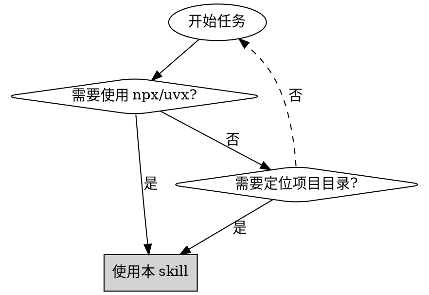
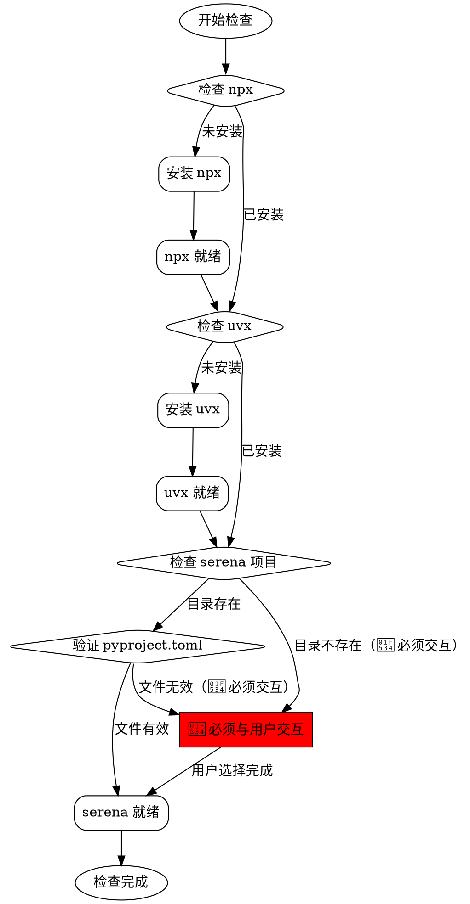

# 前置条件检查

## 概述

自动化环境检查和配置工具，确保项目所需的工具和依赖项正确安装。核心原则：检查-验证-安装-记录。

## ⚠️ 强制规则

### 1. 必须使用中文交互

**所有与用户的交互、提示、询问必须使用中文（中文）**

- ✅ 用户提示信息：中文
- ✅ 错误消息：中文
- ✅ 成功确认：中文
- ✅ AskUserQuestion 内容：中文
- ❌ 禁止使用英文与用户交互

**这是强制性要求，无例外。**

### 2. 必须完成所有三个检查

> **🔴 硬性要求：必须完成所有三个检查，不允许跳过任何检查**

- ✅ **步骤 1**：检查 npx（必须完成）
- ✅ **步骤 2**：检查 uvx（必须完成）
- ✅ **步骤 3**：检查 serena（必须完成，必须与用户交互）

**如果 serena 未找到**：
1. ❌ **禁止跳过**
2. ❌ **禁止报告"将通过 MCP 配置"然后继续**
3. ✅ **必须立即与用户交互**，询问处理方式（自动下载/指定目录/提供已有路径）
4. ✅ **必须等待用户选择并完成配置**
5. ✅ **必须验证配置成功后才能继续**

## 何时使用



**使用场景：**
- 启动需要 serena 的开发任务
- 环境初始化和配置
- CI/CD 流水线环境准备
- 新开发者环境搭建
- 跨平台环境一致性检查

**不适用场景：**
- 工具已确认安装且版本正确
- 仅需检查单个工具（直接使用命令更快）
- 非开发环境（生产部署使用其他工具）

## 核心模式

### 检查流程

> **🔴 硬性要求：必须完成所有三个检查，不允许跳过任何步骤**



**重要说明**：
- 🔴 **当 serena 未找到时**，必须进入 `user_choice` 节点与用户交互
- ❌ **禁止行为**：报告"将通过 MCP 配置"然后跳过
- ✅ **正确行为**：立即询问用户选择处理方式（自动下载/指定目录/提供已有路径）

### ❌ 错误示例 vs ✅ 正确示例

#### ❌ 错误示例（禁止）

```
步骤3：检查 serena
● ✗ 默认目录不存在：/home/michael/serena
● ✗ serena：未在 PATH 中找到（将通过 MCP 配置）  ← 错误！

步骤4：继续执行下一步...  ← 禁止！
```

**问题**：报告"将通过 MCP 配置"然后继续，没有与用户交互。

#### ✅ 正确示例（必须）

```
步骤3：检查 serena
● ✗ 默认目录不存在：/home/michael/serena
● 🔴 未找到有效的 serena 项目目录

询问用户：请选择处理方式
┌────────────────────────────────────────┐
│ 1. 使用默认目录自动下载               │
│ 2. 指定下载目录                       │
│ 3. 使用已有的 serena 项目             │
└────────────────────────────────────────┘

用户选择：1. 使用默认目录自动下载

执行：正在下载 serena 项目...
● ✓ serena 项目已成功下载到：/home/michael/serena

验证：✓ serena 项目验证通过

步骤4：继续执行下一步...  ← 正确！
```

**正确**：立即与用户交互，等待用户选择，完成配置后才继续。

## 快速参考

| 步骤 | 检查命令 | 成功标志 | 失败处理 |
|------|---------|---------|---------|
| **1. npx** | `npx --version` | 输出版本号 | 自动安装稳定版本 |
| **2. uvx** | `uvx --version` | 输出版本号 | 自动安装稳定版本 |
| **3. serena** | 检查默认目录 | 存在且有效 | 提示用户选择 |

### serena 默认目录

> **重要：只检查以下默认路径，不要查找其他路径（如 `~/.serena` 等）**

| 系统 | 默认路径 |
|------|---------|
| **macOS** | `/Users/username/serena` |
| **Linux** | `/home/username/serena` |
| **Windows** | `C:\Users\username\serena` |

**检查逻辑**：
1. 根据当前操作系统，**只检查对应的默认路径**
2. 不查找其他任何路径（禁止发散查找 `~/.serena`、`./serena` 等）
3. 如果默认路径不存在或无效，直接询问用户提供路径

### serena 验证标准

**有效路径：** 目录存在 + 包含 `pyproject.toml` 文件

**无效路径：**
- 目录不存在
- 目录存在但缺少 `pyproject.toml`
- `pyproject.toml` 损坏或不完整

## 实施步骤

### 步骤 1：检查 npx

```bash
# 检查命令
npx --version

# 未安装时的处理
# Node.js 包管理器会自动安装 npx
```

**行为（必须使用中文输出）：**
- ✅ **已安装**：向用户报告 "✓ npx 已安装（版本：{版本号}）"，继续步骤 2
- ❌ **未安装**：向用户报告 "正在安装 npx..."，自动安装稳定版本，安装完成后报告 "✓ npx 安装成功"，继续步骤 2

### 步骤 2：检查 uvx

```bash
# 检查命令
uvx --version

# 未安装时的处理
# 使用 pip 或系统包管理器安装 uv 工具链
```

**行为（必须使用中文输出）：**
- ✅ **已安装**：向用户报告 "✓ uvx 已安装（版本：{版本号}）"，继续步骤 3
- ❌ **未安装**：向用户报告 "正在安装 uvx..."，自动安装稳定版本，安装完成后报告 "✓ uvx 安装成功"，继续步骤 3

### 步骤 3：检查 serena 项目

> **🔴 重要：只检查默认目录**
>
> - ✅ **只检查**：根据操作系统确定的默认路径（见下表）
> - ❌ **禁止查找**：`~/.serena`、`./serena`、`/opt/serena` 等其他路径
> - 如果默认路径不存在或无效，**直接询问用户提供路径**

#### 3.0 确定默认目录

**必须使用中文向用户报告检查进度**

首先，根据当前操作系统确定默认目录：

```bash
# 根据操作系统设置默认目录
if [[ "$OSTYPE" == "darwin"* ]]; then
  # macOS
  SERENA_DEFAULT_DIR="/Users/$(whoami)/serena"
elif [[ "$OSTYPE" == "linux-gnu"* ]]; then
  # Linux
  SERENA_DEFAULT_DIR="/home/$(whoami)/serena"
elif [[ "$OSTYPE" == "msys" ]] || [[ "$OSTYPE" == "cygwin" ]]; then
  # Windows (Git Bash / Cygwin)
  SERENA_DEFAULT_DIR="C:\\Users\\$(whoami)\\serena"
else
  # 未知系统，提示用户提供路径
  SERENA_DEFAULT_DIR=""
fi
```

**重要**：只使用上述默认路径，**不要**查找其他路径（如 `~/.serena`、`./serena` 等）

#### 3.1 检查默认目录

**必须使用中文向用户报告检查进度**

根据步骤 3.0 确定的默认目录，进行检查：

```bash
# 检查默认目录是否已确定
if [ -z "$SERENA_DEFAULT_DIR" ]; then
  # 未知系统，直接询问用户
  prompt_user_choice
  exit 0
fi

# 检查目录是否存在
if [ -d "$SERENA_DEFAULT_DIR" ]; then
  # 检查 pyproject.toml 是否存在
  if [ -f "$SERENA_DEFAULT_DIR/pyproject.toml" ]; then
    # 路径有效，保存并继续
    SERENA_PATH="$SERENA_DEFAULT_DIR"
    echo "✓ 在默认目录找到 serena 项目：$SERENA_PATH"
  else
    # 路径无效，提示用户选择
    echo "✗ 默认目录存在，但缺少 pyproject.toml 文件"
    prompt_user_choice
  fi
else
  # 目录不存在，提示用户选择
  echo "✗ 默认目录不存在：$SERENA_DEFAULT_DIR"
  prompt_user_choice
fi
```

**行为（必须使用中文输出）：**
- ✅ **找到有效路径**：向用户报告 "✓ 在默认目录找到 serena 项目：{路径}"
- ❌ **目录不存在**：向用户报告 "默认目录中未找到 serena 项目"，进入步骤 3.2
- ❌ **路径无效（缺少 pyproject.toml）**：向用户报告 "serena 项目路径无效，缺少必要文件"，进入步骤 3.2

#### 3.2 用户选择（当自动检查失败时）

**重要：所有与用户的交互必须使用中文**

使用 AskUserQuestion 工具向用户展示以下选项：

**交互提示内容：**

```yaml
问题: "未找到有效的 serena 项目目录，请选择处理方式："
选项:
  - 标签: "使用默认目录自动下载"
    说明: "在默认目录 {默认路径} 中自动下载 serena 项目"

  - 标签: "指定下载目录"
    说明: "您指定一个目录，我会在该目录中下载 serena 项目"

  - 标签: "指定已有目录"
    说明: "您已经手动下载过 serena，提供项目路径"
```

**选项 1 处理流程：使用默认目录自动下载**
1. 提示用户："正在默认目录下载 serena 项目..."
2. 在默认目录执行 `git clone https://github.com/oraios/serena.git`
3. **验证下载成功**：
   - 检查目录是否存在：`ls -la $SERENA_DEFAULT_DIR`
   - 检查 `pyproject.toml` 是否存在：`ls -la $SERENA_DEFAULT_DIR/pyproject.toml`
4. **如果验证失败**：
   - 提示用户："✗ serena 项目下载失败或文件不完整"
   - **返回步骤 3.2**，让用户重新选择处理方式
5. **如果验证成功**：
   - 提示用户："✓ serena 项目已成功下载到：{默认路径}"
   - 记录路径为 `$SERENA_DEFAULT_DIR`
   - **进入步骤 3.3 验证流程**

**选项 2 处理流程：指定下载目录**
1. 提示用户："请输入您希望下载 serena 的目录路径："
2. 等待用户输入路径
3. 验证路径有效性（是否存在、是否有写入权限）
4. 如果路径无效：
   - 提示："路径无效或无写入权限，请重新输入"
   - **返回步骤 2**，重新输入路径
5. 在指定目录执行 `git clone https://github.com/oraios/serena.git`
6. **验证下载成功**：
   - 检查目录是否存在
   - 检查 `pyproject.toml` 是否存在
7. **如果验证失败**：
   - 提示用户："✗ serena 项目下载失败或文件不完整"
   - **返回步骤 3.2**，让用户重新选择处理方式
8. **如果验证成功**：
   - 提示用户："✓ serena 项目已成功下载到：{用户指定路径}"
   - 记录用户指定的路径
   - **进入步骤 3.3 验证流程**

**选项 3 处理流程：指定已有 serena 目录**
1. 提示用户："请输入已下载的 serena 项目路径："
2. 等待用户输入路径
3. **验证路径有效性**：
   - 检查目录是否存在：`ls -la {用户路径}`
   - 检查 `pyproject.toml` 是否存在：`ls -la {用户路径}/pyproject.toml`
4. **如果验证失败**：
   - 提示用户："✗ 路径无效或缺少 pyproject.toml 文件"
   - **返回步骤 3.2**，让用户重新选择处理方式
5. **如果验证成功**：
   - 提示用户："✓ serena 项目路径验证成功：{用户提供的路径}"
   - 记录路径
   - **进入步骤 3.3 验证流程**

#### 3.3 最终验证流程（所有选项必须执行）

**重要：此步骤为强制验证，不可跳过**

```bash
# 验证 serena 路径是否已记录
if [ -z "$SERENA_PATH" ]; then
  echo "✗ 错误：serena 路径未正确配置"
  exit 1
fi

# 验证目录是否存在
if [ ! -d "$SERENA_PATH" ]; then
  echo "✗ 错误：serena 目录不存在：$SERENA_PATH"
  exit 1
fi

# 验证 pyproject.toml 是否存在
if [ ! -f "$SERENA_PATH/pyproject.toml" ]; then
  echo "✗ 错误：缺少 pyproject.toml 文件：$SERENA_PATH/pyproject.toml"
  exit 1
fi

# 验证 pyproject.toml 是否可读
if [ ! -r "$SERENA_PATH/pyproject.toml" ]; then
  echo "✗ 错误：pyproject.toml 文件不可读"
  exit 1
fi

# 所有验证通过
echo "✓ serena 项目验证通过：$SERENA_PATH"
```

**行为（必须使用中文输出）：**
- ✅ **验证通过**：向用户报告 "✓ serena 项目配置成功，路径：{路径}"，继续下一步
- ❌ **验证失败**：向用户报告具体错误，**返回步骤 3.2** 重新选择

**错误处理：**
- 如果 git 克隆失败，提示："✗ 下载失败，请检查网络连接或 git 是否正确安装"，**返回步骤 3.2**
- 如果路径权限不足，提示："✗ 权限不足，请选择有写入权限的目录"，**返回步骤 3.2**
- 如果用户取消选择，提示："✗ 必须配置 serena 才能继续，无法继续下一步"，**停止执行**

## 常见错误

| 错误 | 原因 | 解决方案 |
|------|------|---------|
| **npx 安装失败** | Node.js 未安装 | 先安装 Node.js |
| **uvx 安装失败** | Python/pip 不可用 | 先安装 Python |
| **serena 克隆失败** | 网络问题或 git 未安装 | 检查网络连接和 git |
| **pyproject.toml 缺失** | 克隆不完整或损坏 | 删除目录重新克隆 |
| **路径权限错误** | 无写入权限 | 使用有权限的目录 |
