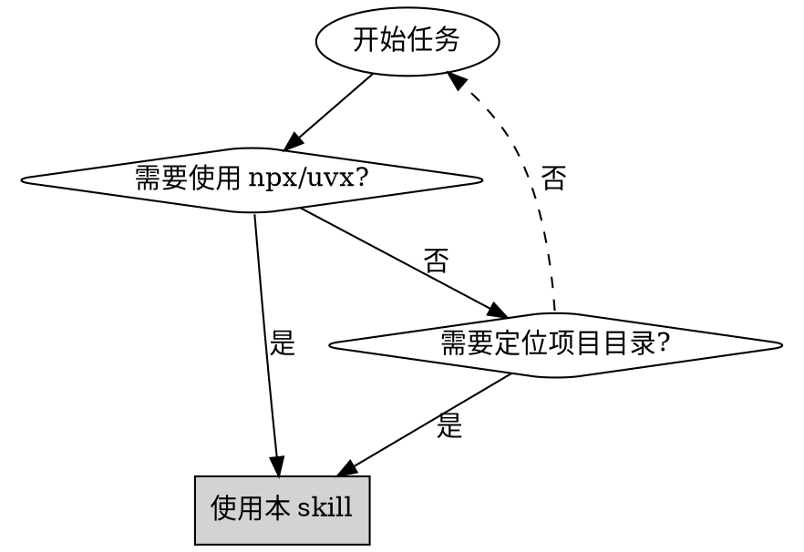
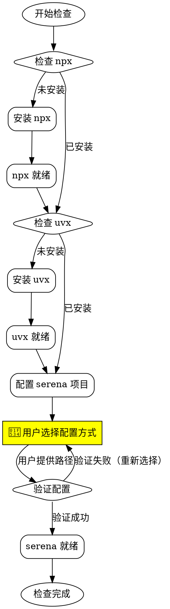

# 前置条件检查

## 概述

自动化环境检查和配置工具，确保项目所需的工具和依赖项正确安装。

**核心原则**：检查-验证-安装-记录

**强制规则**：
1. **所有交互必须使用中文** - 提示、错误消息、用户询问一律中文
2. **必须完成所有三个检查** - 不允许跳过 npx/uvx/serena 任一步骤
3. **serena 配置必须询问用户** - 提供三个选项让用户选择，验证失败必须重新选择

## 何时使用



**使用场景**：启动需要 serena 的开发任务、环境初始化、CI/CD 环境准备、新开发者环境搭建

**不适用场景**：工具已确认安装、仅需检查单个工具、非开发环境

## 检查流程



## 快速参考

| 步骤 | 检查命令 | 成功标志 | 失败处理 |
|------|---------|---------|---------|
| **1. npx** | `npx --version` | 输出版本号 | 自动安装稳定版本 |
| **2. uvx** | `uvx --version` | 输出版本号 | 自动安装稳定版本 |
| **3. serena** | 用户选择配置方式 | 路径验证通过 | 重新选择或输入路径 |

### serena 默认目录

| 系统 | 默认路径 |
|------|---------|
| **macOS** | `/Users/username/.cadence/serena` |
| **Linux** | `/home/username/.cadence/serena` |
| **Windows** | `C:\Users\username\.cadence\serena` |

**验证标准**：目录存在 + 包含 `pyproject.toml` 文件

**自动创建**：如果 `.cadence` 父目录不存在，自动创建它

## 实施步骤

### 步骤 1：检查 npx

```bash
npx --version
```

**行为（中文输出）**：
- ✅ **已安装**：报告 "✓ npx 已安装（版本：{版本号}）"
- ❌ **未安装**：报告 "正在安装 npx..."，自动安装，完成后报告 "✓ npx 安装成功"

### 步骤 2：检查 uvx

```bash
uvx --version
```

**行为（中文输出）**：
- ✅ **已安装**：报告 "✓ uvx 已安装（版本：{版本号}）"
- ❌ **未安装**：报告 "正在安装 uvx..."，自动安装，完成后报告 "✓ uvx 安装成功"

### 步骤 3：serena 项目目录确认（我只是单纯需要这个项目的源码，不需要你帮我创建虚拟环境）

**重要规则**：
- 🔴 **必须询问用户选择** - 不自动检查或假设路径
- 🔴 **提供三个选项** - 自动下载、指定下载位置、使用已有项目
- 🔴 **验证失败必须重新选择** - 禁止报告"将通过 MCP 配置"后继续

#### 3.1 用户选择配置方式

使用 AskUserQuestion 工具（**必须使用中文**）：

**选项 1：自动下载到默认目录（~/.cadence/serena/）**
- 检查父目录 `.cadence` 是否存在，不存在则自动创建
- 在默认目录（~/.cadence/serena/）执行：`git clone https://github.com/oraios/serena.git`
- 验证：检查目录和 `pyproject.toml` 是否存在
- 成功：报告 "✓ serena 项目已成功下载"，进入步骤 3.2
- 失败：报告错误，**返回步骤 3.1 重新选择**

**选项 2：指定下载目录**
- 询问用户输入路径
- 验证路径有效性和写入权限
- 在指定目录执行 git clone
- 验证成功 → 进入步骤 3.2；失败 → **返回步骤 3.1**

**选项 3：使用已有目录**
- 询问用户输入已有 serena 项目路径
- 验证目录存在且包含 `pyproject.toml`
- 验证成功 → 进入步骤 3.2；失败 → **返回步骤 3.1**

#### 3.2 最终验证

**强制验证，不可跳过**：
1. 验证 serena 路径已记录
2. 验证目录存在
3. 验证 `pyproject.toml` 存在且可读
4. 全部通过 → 报告 "✓ serena 项目验证成功"
5. 任一失败 → 报告错误，**返回步骤 3.1**

## 常见错误

| 错误 | 原因 | 解决方案 |
|------|------|---------|
| **npx 安装失败** | Node.js 未安装 | 先安装 Node.js |
| **uvx 安装失败** | Python/pip 不可用 | 先安装 Python |
| **创建父目录失败** | 无权限创建 `.cadence` | 检查用户目录权限或手动创建 |
| **serena 克隆失败** | 网络问题或 git 未安装 | 检查网络连接和 git |
| **pyproject.toml 缺失** | 克隆不完整或损坏 | 删除目录重新克隆 |
| **路径权限错误** | 无写入权限 | 使用有权限的目录 |
