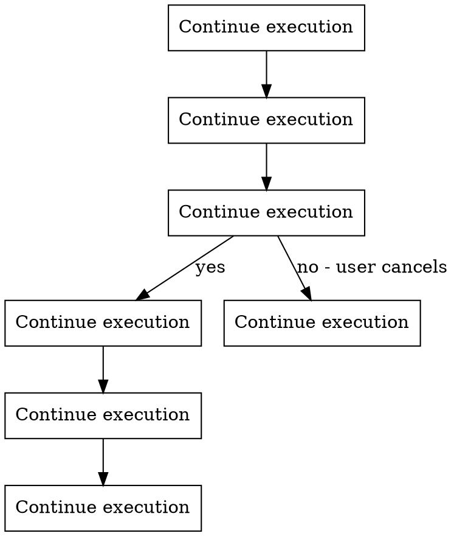

# Resume - Resume Interrupted Work

## Overview

**Core Principle**: Scan for incomplete sessions, let user select one, rebuild full context, and continue from the right point.

Resume enables seamless continuation after interruptions by:
- Detecting all incomplete sessions
- Displaying resumable sessions with progress info
- Rebuilding complete context (Git, TodoWrite, project state)
- Continuing from the last checkpoint

## When to Use

**Use this skill when:**
- Recovering from an interrupted session
- Resuming work on an incomplete project
- Continuing after a break
- Switching back to a previous project

**Do not use for:**
- Starting new work (start a new flow instead)
- Viewing current progress (use `/status` instead)
- Creating checkpoints (use `/checkpoint` instead)

## Resume Process Flow



## The Process

### Step 1: Scan for Incomplete Sessions

**List all progress records:**
```markdown
Call: mcp__serena__list_memories
Parameter: topic = "progress" (or pattern = "progress-*")
```

**Filter incomplete sessions:**
```python
incomplete_sessions = []
for memory_name in memories:
    if memory_name.startswith("progress-"):
        progress = read_memory(memory_name)
        # Check if incomplete
        if progress["overall_progress"]["percentage"] < 100:
            incomplete_sessions.append({
                "memory_name": memory_name,
                "project_id": progress["metadata"]["project_id"],
                "project_name": progress["project_info"]["name"],
                "flow_type": progress["metadata"]["flow_type"],
                "current_phase": progress["project_info"]["current_phase"],
                "progress_percentage": progress["overall_progress"]["percentage"],
                "completed_phases": progress["overall_progress"]["completed_phases"],
                "total_phases": progress["overall_progress"]["total_phases"],
                "updated_at": progress["metadata"]["updated_at"],
                "git_branch": progress["project_info"]["git_branch"]
            })
```

### Step 2: Display Resumable Sessions

**Format session list:**
```markdown
## 可恢复的会话

{for i, session in enumerate(incomplete_sessions, 1)}
{i}. **{session['project_name']}** ({session['flow_type']})
   - 当前进度: {session['progress_percentage']}% ({session['completed_phases']}/{session['total_phases']} 节点)
   - 当前阶段: {session['current_phase']}
   - 最后更新: {session['updated_at']}
   - Git 分支: {session['git_branch']}

{end for}

选择要恢复的会话 [1-{len(incomplete_sessions)}]: "
```

**Example output:**
```
## 可恢复的会话

1. **User Authentication System** (full-flow)
   - 当前进度: 37.5% (3/8 节点)
   - 当前阶段: Design (进行中)
   - 最后更新: 2026-03-04 15:30:00
   - Git 分支: feature/user-auth

2. **API Refactor** (quick-flow)
   - 当前进度: 50% (2/4 节点)
   - 当前阶段: Plan (已完成)
   - 最后更新: 2026-03-03 17:00:00
   - Git 分支: refactor/api

选择要恢复的会话 [1-2]:
```

### Step 3: User Selection

**Wait for user input:**
```markdown
# Read user selection
selection = input("选择要恢复的会话 [1-{}]: ".format(len(incomplete_sessions)))

# Validate selection
if not selection.isdigit():
    print("请输入数字")
    return

selection_idx = int(selection) - 1
if selection_idx < 0 or selection_idx >= len(incomplete_sessions):
    print("无效的选择")
    return

selected_session = incomplete_sessions[selection_idx]
```

### Step 4: Read Latest Checkpoint

**Find latest checkpoint:**
```markdown
Call: mcp__serena__list_memories
Parameter: topic = "checkpoint-{project_id}"

# Filter checkpoints for this project
project_checkpoints = [m for m in memories if m.startswith(f"checkpoint-{project_id}-")]

# Sort by timestamp (latest first)
latest_checkpoint = None
for checkpoint_name in project_checkpoints:
    checkpoint = read_memory(checkpoint_name)
    if latest_checkpoint is None or checkpoint["timestamp"] > latest_checkpoint["timestamp"]:
        latest_checkpoint = checkpoint
        latest_checkpoint_name = checkpoint_name
```

**Read checkpoint data:**
```markdown
Call: mcp__serena__read_memory
Parameter: memory_name = {latest_checkpoint_name}

# Extract context
git_branch = checkpoint["context"]["git_branch"]
git_commits = checkpoint["context"]["git_commits"]
todowrite_state = checkpoint["context"]["todowrite_state"]
project_context = checkpoint["context"]["project_context"]
current_phase = checkpoint["phase"]
```

### Step 5: Rebuild Context

**Switch to Git branch:**
```bash
git checkout {git_branch}
git pull origin {git_branch}  # Optional: sync with remote
```

**Restore TodoWrite state:**
```markdown
For each task in todowrite_state:
    if task not in current TodoWrite:
        # Recreate task
        Call: TodoWrite/Create
        Parameters: subject, description, status, etc.

    # Update existing tasks
    Call: TodoWrite/Update
    Parameters: taskId, status, etc.
```

**Load project context:**
```markdown
1. Read .claude/CLAUDE.md
2. Verify project matches checkpoint
3. Load flow type and phase information
```

**Determine next phase:**
```python
# Read progress record
progress = read_memory(f"progress-{project_id}")

# Find next incomplete phase
phases = progress["phases"]
next_phase = None
for phase in phases:
    if phase["status"] == "pending":
        next_phase = phase
        break
    elif phase["status"] == "in_progress":
        next_phase = phase
        break

if next_phase:
    print(f"继续执行: {next_phase['phase_name']}")
```

### Step 6: Display Recovery Status

**Show recovery summary:**
```markdown
✅ 会话已恢复!

## 恢复信息
- **项目**: {project_name}
- **流程**: {flow_type}
- **恢复点**: {current_phase} ({checkpoint_timestamp})
- **Git 分支**: {git_branch}
- **下次行动**: {next_phase}

## 上下文状态
- ✅ Git 分支已切换
- ✅ TodoWrite 任务已恢复 ({task_count} 个任务)
- ✅ 项目上下文已加载

## 继续执行
准备继续 **{next_phase}** 阶段...
```

## Quick Reference

### Resume Checklist

| Step | Action | Tool |
|------|-------|------|
| 1 | Scan incomplete | `list_memories(progress-*)` |
| 2 | Display sessions | Format and show |
| 3 | User selection | Read input |
| 4 | Read checkpoint | `read_memory(checkpoint-*)` |
| 5 | Rebuild context | Git, TodoWrite, CLAUDE.md |
| 6 | Display status | Console output |

### Session Selection Criteria

Sessions are resumable if:
- Progress < 100%
- Has progress record
- Has checkpoint(s)

### Recovery Priorities

**Resume latest session:**
- Most recent `updated_at`
- Same project as current directory

**Resume incomplete session:**
- Any session with `percentage < 100`

## Code Example

### Scanning for Incomplete Sessions

```python
import json
from typing import List, Dict

def scan_incomplete_sessions() -> List[Dict]:
    """Scan Serena memory for incomplete progress records."""

    # List all progress memories
    memories = list_memories(topic="progress")

    incomplete = []
    for memory_name in memories:
        if not memory_name.startswith("progress-"):
            continue

        # Read progress data
        progress = read_memory(memory_name)

        # Check if incomplete
        percentage = progress["overall_progress"]["percentage"]
        if percentage < 100:
            incomplete.append({
                "memory_name": memory_name,
                "project_id": progress["metadata"]["project_id"],
                "project_name": progress["project_info"]["name"],
                "flow_type": progress["metadata"]["flow_type"],
                "current_phase": progress["project_info"]["current_phase"],
                "progress_percentage": percentage,
                "completed_phases": progress["overall_progress"]["completed_phases"],
                "total_phases": progress["overall_progress"]["total_phases"],
                "updated_at": progress["metadata"]["updated_at"],
                "git_branch": progress["project_info"]["git_branch"]
            })

    # Sort by updated_at (most recent first)
    incomplete.sort(key=lambda x: x["updated_at"], reverse=True)

    return incomplete

def display_sessions(sessions: List[Dict]) -> None:
    """Display resumable sessions to user."""

    print("## 可恢复的会话\n")

    for i, session in enumerate(sessions, 1):
        print(f"{i}. **{session['project_name']}** ({session['flow_type']})")
        print(f"   - 当前进度: {session['progress_percentage']}% ({session['completed_phases']}/{session['total_phases']} 节点)")
        print(f"   - 当前阶段: {session['current_phase']}")
        print(f"   - 最后更新: {session['updated_at']}")
        print(f"   - Git 分支: {session['git_branch']}")
        print()

    print(f"选择要恢复的会话 [1-{len(sessions)}]: ", end="")

# Example usage
sessions = scan_incomplete_sessions()
if sessions:
    display_sessions(sessions)
else:
    print("✅ 没有找到可恢复的会话")
```

### Rebuilding Context

```python
def rebuild_context(checkpoint_data: Dict) -> None:
    """Rebuild session context from checkpoint."""

    print("🔨 重建上下文...\n")

    # Extract context
    git_branch = checkpoint_data["context"]["git_branch"]
    todowrite_state = checkpoint_data["context"]["todowrite_state"]
    project_context = checkpoint_data["context"]["project_context"]

    # Step 1: Switch Git branch
    print(f"1. 切换到 Git 分支: {git_branch}")
    run_command(f"git checkout {git_branch}")

    # Step 2: Restore TodoWrite
    print(f"2. 恢复 TodoWrite 状态 ({len(todowrite_state)} 个任务)")
    for task in todowrite_state:
        # Restore each task
        restore_todowrite_task(task)

    # Step 3: Load project context
    print(f"3. 加载项目上下文: {project_context['name']}")
    load_project_context(project_context)

    print("\n✅ 上下文重建完成!")

# Example usage
checkpoint = read_memory("checkpoint-user-auth-design-550e8400...")
rebuild_context(checkpoint)
```

## Common Mistakes

### ❌ Not Sorting Sessions by Recency

```python
# ❌ BAD: Random order, user sees old sessions first
sessions = incomplete_sessions  # Unsorted
```

**Problem**: User has to scan entire list to find recent work

```python
# ✅ GOOD: Most recent first
sessions = sorted(incomplete_sessions, key=lambda x: x["updated_at"], reverse=True)
```

### ❌ Not Validating User Selection

```python
# ❌ BAD: Crashes on invalid input
selection = int(input("Select session: "))
session = sessions[selection - 1]
```

**Problem**: IndexError if selection out of range

```python
# ✅ GOOD: Validate and retry
while True:
    try:
        selection = int(input("Select session [1-{}]: ".format(len(sessions))))
        if 1 <= selection <= len(sessions):
            session = sessions[selection - 1]
            break
        print("Invalid selection. Please try again.")
    except ValueError:
        print("Please enter a number.")
```

### ❌ Not Finding Latest Checkpoint

```python
# ❌ BAD: Uses first checkpoint found (may be old)
checkpoint = read_memory(project_checkpoints[0])
```

**Problem**: Resumes from old checkpoint, loses recent progress

```python
# ✅ GOOD: Find latest by timestamp
latest = None
for name in project_checkpoints:
    cp = read_memory(name)
    if latest is None or cp["timestamp"] > latest["timestamp"]:
        latest = cp
```

### ❌ Not Restoring TodoWrite State

```python
# ❌ BAD: Just reads checkpoint, doesn't restore tasks
checkpoint = read_memory(latest_checkpoint)
print("Session restored!")
```

**Problem**: TodoWrite is empty, agent has no task context

```python
# ✅ GOOD: Restore tasks to TodoWrite
checkpoint = read_memory(latest_checkpoint)
for task in checkpoint["context"]["todowrite_state"]:
    recreate_todowrite_task(task)
print("TodoWrite state restored!")
```

### ❌ Not Switching Git Branch

```python
# ❌ BAD: Assumes user is on correct branch
# (doesn't switch)
print("Resuming from current branch...")
```

**Problem**: Wrong branch, wrong context, potential conflicts

```python
# ✅ GOOD: Switch to checkpoint's branch
git_branch = checkpoint["context"]["git_branch"]
run_command(f"git checkout {git_branch}")
print(f"Switched to branch: {git_branch}")
```

## Red Flags

**STOP and verify if:**
- Sessions list is empty (check memory access)
- No checkpoints found (create one first)
- User on wrong branch (switch before resuming)
- TodoWrite is empty (restore tasks)
- Progress record is corrupted (validate data structure)

## Testing Checklist

Before deploying:
- [ ] Scans for incomplete sessions correctly
- [ ] Filters by percentage < 100
- [ ] Sorts by updated_at (most recent first)
- [ ] Displays all required information
- [ ] Validates user selection
- [ ] Finds latest checkpoint
- [ ] Switches Git branch
- [ ] Restores TodoWrite state
- [ ] Loads project context
- [ ] Determines next phase
- [ ] Displays recovery summary
